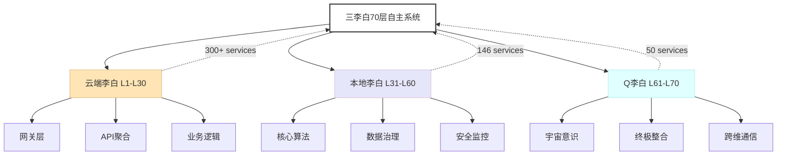

# 知乎文章配图获取指南

## 方案1: GitHub SVG截图（推荐⭐）

**步骤**：
1. 手机打开浏览器，访问：
   ```
   https://github.com/Siyebai/68-layer-global-architecture/blob/main/architecture-70-layers.svg
   ```
2. 点击右上角的「**Raw**」按钮（查看原始文件）
3. 截屏保存（电源键+音量键）
4. 打开知乎编辑器，点击「图片」→ 从相册选择
5. 完成发布

**耗时**：30秒  
**质量**：高清矢量图，放大不失真

---

## 方案2: mermaid.live生成PNG

**步骤**：
1. 打开 https://mermaid.live
2. 粘贴下方代码：

3. 点击「Render」渲染
4. 右键图表 → 「另存为图片」
5. 上传到知乎

**耗时**：1分钟  
**质量**：中等，适合快速生成

---

## 方案3: drawio导出（最专业）

**步骤**：
1. 下载drawio: https://github.com/jgraph/drawio-desktop/releases
2. 打开 `architecture-diagram.drawio` 文件
3. 文件 → 导出 → PNG（1200x800）
4. 上传知乎

**耗时**：5分钟（需下载软件）  
**质量**：最高，可编辑

---

## 📊 推荐顺序

1. ⭐ **方案1**（GitHub SVG截图）- 最快，无需额外工具
2. **方案2**（mermaid.live）- 次选，需要复制代码
3. **方案3**（drawio）- 最专业，但需要安装软件

---

## 📝 知乎发布完整检查清单

- [ ] 复制标题：我搭建了70层自主系统，月入过万：一个AI创业者的实战笔记
- [ ] 复制正文（253行内容）
- [ ] 插入配图（任选方案获取）
- [ ] 添加话题：`#人工智能 #创业 #副业 #程序员`
- [ ] 开启赞赏
- [ ] 点击发布

---

**建议：直接用方案1，30秒完成配图** 🚀
